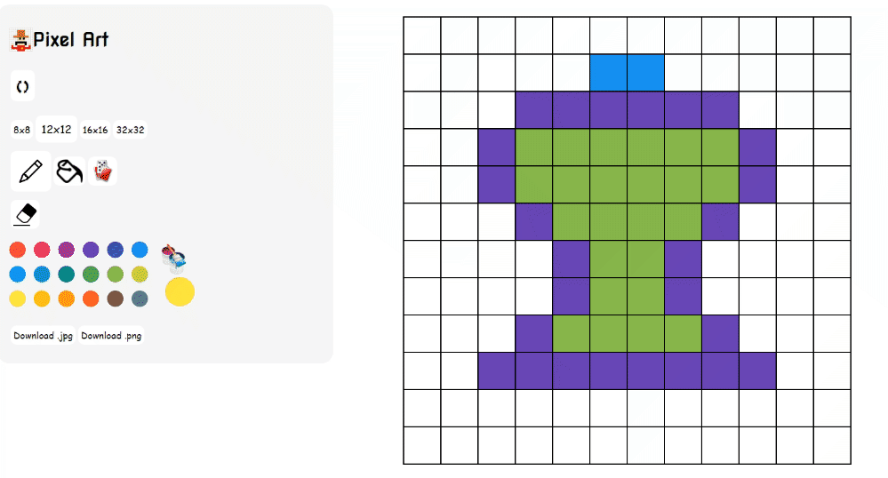

<a href="https://amropixelart.netlify.app/">Click here for Deployed Website Link</a>

# Features

 

**Who doesn't like Pixel Art?	:bricks:**
That's right! nobody in their right mind..

Choose the size of your Pixel Canavas :straight_ruler:, pick your favourite colors :basket:, erase mistakes:scissors: then click download to download your awesome artistic piece in your desired format	:file_cabinet:..

**Box fill tool**

Lets you color neighbouring pixels with the selected color:

**Color-match fill tool**

Lets you change background color as well as similar color patterns:

# Used technologies / Frameworks
**javaScript / React.js**

React.js state handling model is ideal for single page applications, where components are selectively rendered on the same page

# Used 3rd Party Libraries
**I use the following 3rd party libraries in my project:**

**"react-color":** abstracts the task of color selection instead of creating indvidual reptitive buttons

**"react-component-export-image":** enables exporting of App's Grid component as a downloadable image in different formats

**"styled-components":** a general personal preference when writing React, and in this Project it was of immense help to dynamically render styles;
 saving my soul from a messy jungle of redundant conditional statements
 
# Getting Started with Create React App

This project was bootstrapped with [Create React App](https://github.com/facebook/create-react-app).

## Available Scripts

In the project directory, you can run:

### `npm install`
installs required dev dependencies

### `npm start`

Runs the app in the development mode.\
Open [http://localhost:3000](http://localhost:3000) to view it in the browser.

The page will reload if you make edits.\
You will also see any lint errors in the console.

### `npm test`

Launches the test runner in the interactive watch mode.\
See the section about [running tests](https://facebook.github.io/create-react-app/docs/running-tests) for more information.

### `npm run build`

Builds the app for production to the `build` folder.\
It correctly bundles React in production mode and optimizes the build for the best performance.

The build is minified and the filenames include the hashes.\
Your app is ready to be deployed!

See the section about [deployment](https://facebook.github.io/create-react-app/docs/deployment) for more information.
